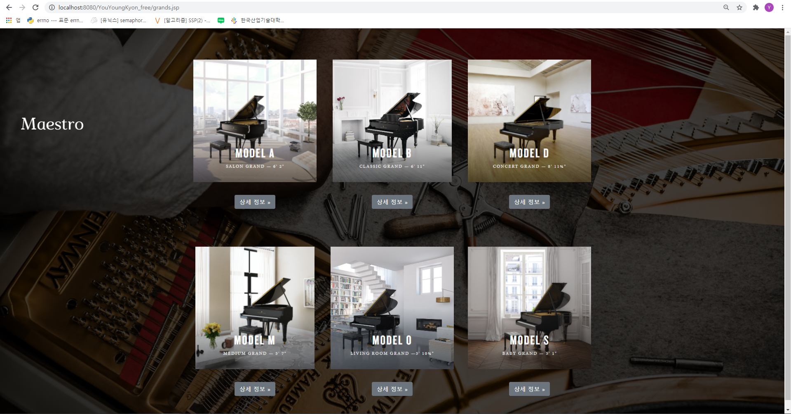

# 메인 페이지
### 메인 홈은 mute, loop 형태로 동영상을 넣어서 실행함

# 회원가입 창
### 폼에 맞게 회원가입을 하게 끔 만듬

# 메인 홈 페이지
### 각종 카테고리와 중간에 버튼이 있고 내장 객체로 인해 각 유저의 이름을 나타내줌

# 피아니스트들 목록 페이지
### 유명한 피아니스트들의 사진과 이름을 볼 수 있는 페이지

# 그랜드 피아노 종류
### 각종 그랜드 피아노 모델들을 볼 수 있는 페이지

# 그랜드 피아노 상세 정보
### 그랜드 피아노의 특정 모델을 상세 보기 가능

# 업라이트 피아노 종류
### 각종 업라이트 피아노 모델들을 볼 수 있는 페이지

# 업라이트 피아노 상세 정보
### 업라이트 피아노의 특정 모델을 상세 보기 가능

# 베스트 셀러
### 피아노 회사들의 2016년 수익 표

# 내 정보 수정
### 내가 회원가입 했을 때 입력했던 정보를 수정할 수 있는 페이지

//////////기본 배점(3점)//////////
1. 모델 2 방식으로 프로그램 작성(MVC 패턴)
-controlServlet.java
-pControlServlet.java

2. CSS 파일 분리 작성
-index.jsp<->home.css
-register.jsp<->register.css
-home.jsp<->main.css
-grands.jsp<->grands.css, bootstrap.min.css
-grand.jsp<->bootstrap.min.css
-uprights.jsp<->grands.css, bootstrap.min.css
-upright.jsp<->bootstrap.css
-pianist.jsp<->pianist.css
-mypage.jsp<->mypage.css
-login.jsp<->login.css
-rank.jsp<->rank.css

3. 모델 기능은 VO, DAO 클래스를 분리해서 작성
-PersonDAO.java, PianistDAO.java, PianoDAO.java, RankDAO.java
-PersonVO.java, PianistVO.java, PianoVO.java, RankVO.java

4. 자바 클래스 역할 별(Controller, Persistence, Domain) 패키지 분리 작성
-Controller
-Domain, pianist.domain, piano.domain
-Persistence, pianist.persistence, piano.persistence

5.JDBC를 사용하여 CRUD를 구현할 것(R(Read)는 목록보기 기능 포함)
Create->Insert=PersonDAO.add() 함수
Read->Select=RankingDAO.read() 함수->rank.jsp에서 사용
Update->Update=PersonDAO.update() 함수
Delete->Delete=PersonDAO.delete() 함수
///////////////////////////////////////////////////////////////////////////////

//////////추가(3점)//////////
1. 표현 언어
-grands.jsp, grands.jsp, home.jsp, login.jsp, mypage.jsp, pianist.jsp, register.jsp, upright.jsp, uprights.jsp

2. 커스텀 태그 사용
-WEB-INF/tags/info.tag, WEB-INF/tags/info2.tag, WEB-INF/tags/info3.tag, WEB-INF/tags/info4.tag
-home.jsp-info.tag, info2.tag, info3.tag
-index.jsp-info4.tag
-rank.tag-rank.jsp

3. JSTL 사용
-grands.jsp-><c:forEach>사용
-uprights.jsp-><c:forEach> 사용
-pianist.jsp-><c:forEach> 사용
-rank.tag-><c:forEach> 사용
///////////////////////////////////////////////////////////////////////////

